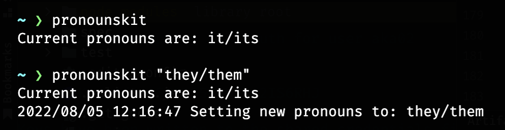

# PronounsKit

> Update your pronouns in various places (currently just Zoom)

This is currently very hacky, only supports Zoom, and requires you to create your own OAuth app for Zoom

## Setup

1. Create a Zoom OAuth app at https://marketplace.zoom.us/develop/create
   1. Redirect URL for OAuth: http://127.0.0.1:14565/oauth/callback
   2. Scopes: user:write
   3. Add the app to your account
2. Export the client and secret from the app as environment variables
   1. `export ZOOM_CLIENT="GxClwCk2Sca82GYDGVMMOw"`
   2. `export ZOOM_SECRET="iL1qPTYj7yx2IfTydI7p1cI9J892llGh"`
3. Install the application
   1. `make install` (assumes /usr/local/bin is in your $PATH and that you have go installed)

## Usage

* Display your current pronouns: `pronounskit`
* Set your pronouns: `pronounskit "they/them"`